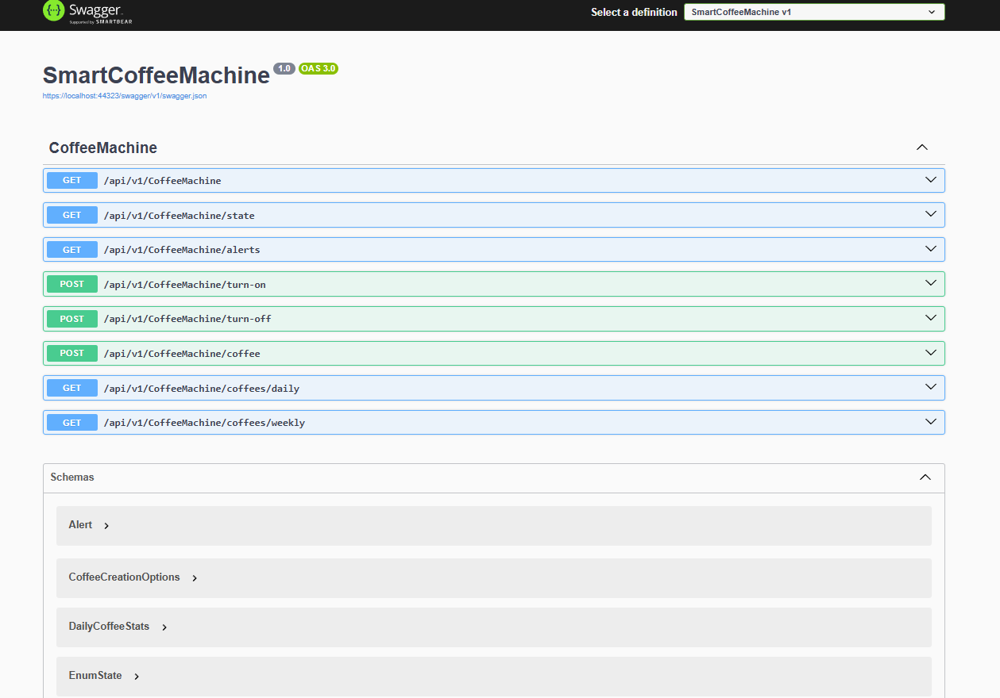

# Smart Coffee Machine Backend

## Overview

This project implements the backend for a smart coffee machine system. The application exposes a RESTful API to control a physical coffee machine, track its usage, and report its current status and alerts. It is designed following SOLID principles and clean architecture, ensuring scalability and maintainability for future enhancements.

The backend is built with **ASP.NET Core**, with a clean separation of concerns using **MVC architecture**. Data persistence is managed through **Entity Framework Core** and a relational database (SQL Server or SQLite for development).

---
## 🔎 Preview


## Features

- Log and persist all actions and usage statistics
- Display current machine state and alerts
- Control the coffee machine (Turn On, Turn Off, Make Coffee)
- RESTful API to expose all relevant functionality
- Utilization statistics:
  - Cups of coffee made per day
  - Cups of coffee made per week

---

## Technology Stack

- ASP.NET Core Web API (.NET 6+)
- Entity Framework Core (Code First)
- SQL Server / SQLite
- AutoMapper
- Swagger for API documentation

---

## Getting Started

### Prerequisites

- [.NET SDK 6.0 or later](https://dotnet.microsoft.com/download)
- SQL Server (or use SQLite in development)
- Optional: Visual Studio 2022 or VS Code

### Setup

1. **Clone the repository**  
   ```bash
   git clone https://github.com/Jahiel/SmartCoffeeMachine.git
   cd SmartCoffeeMachine
   ```

2. **Set up the database**
   - Configure your connection string in `appsettings.json`:
     ```json
     "ConnectionStrings": {
       "DefaultConnection": "Data Source=coffee.db"
     }
     ```
   - Run migrations:
     ```bash
     dotnet ef database update
     ```

3. **Run the application**
   ```bash
   dotnet run
   ```

4. **Access API documentation**
   - Navigate to [http://localhost:5000/swagger](http://localhost:5000/swagger)

---

## Project Structure

```
SmartCoffeeMachine/
├── V1/                         # First version
    ├── Controllers/            # API endpoints
    ├── Models/                 # API models used in response
        ├── Get/                # API models used in GET response
    ├── Core/                   # Business logic
        ├── CoffeeMachine/            
            ├── Class/          # Business Class 
            ├── Interfaces/     # Interfaces for abstraction and DI
            ├── Enum/           # Enum
            ├── Enum/           # Struct
    ├── Migrations/          # EF Core migrations
├── Program.cs           # Entry point
└── appsettings.json     # Configuration
```

---

## API Endpoints (Summary)

| Endpoint                              | Method | Description                    |
|---------------------------------------|--------|--------------------------------|
| `/api/v1/CoffeeMachine`               | GET    | Test if API is working         |
| `/api/v1/CoffeeMachine/state`         | GET    | Get current machine state      |
| `/api/v1/CoffeeMachine/alerts`        | GET    | Get current alerts             |
| `/api/v1/CoffeeMachine/turn-on`       | POST   | Turn on machine                |
| `/api/v1/CoffeeMachine/turn-off`      | POST   | Turn off machine               |
| `/api/v1/CoffeeMachine/coffee`        | POST   | Make a cup of coffee           |
| `/api/v1/CoffeeMachine/coffees/daily` | GET    | Daily cup statistics           |
| `/api/v1/CoffeeMachine/coffees/weekly`| GET    | Hourly cup statistics          |

Full documentation available via Swagger.

## License

This project is licensed under the **GNU GENERAL PUBLIC LICENSE Version 3, 29 June 2007**. See `LICENCE.TXT` for full license text.

